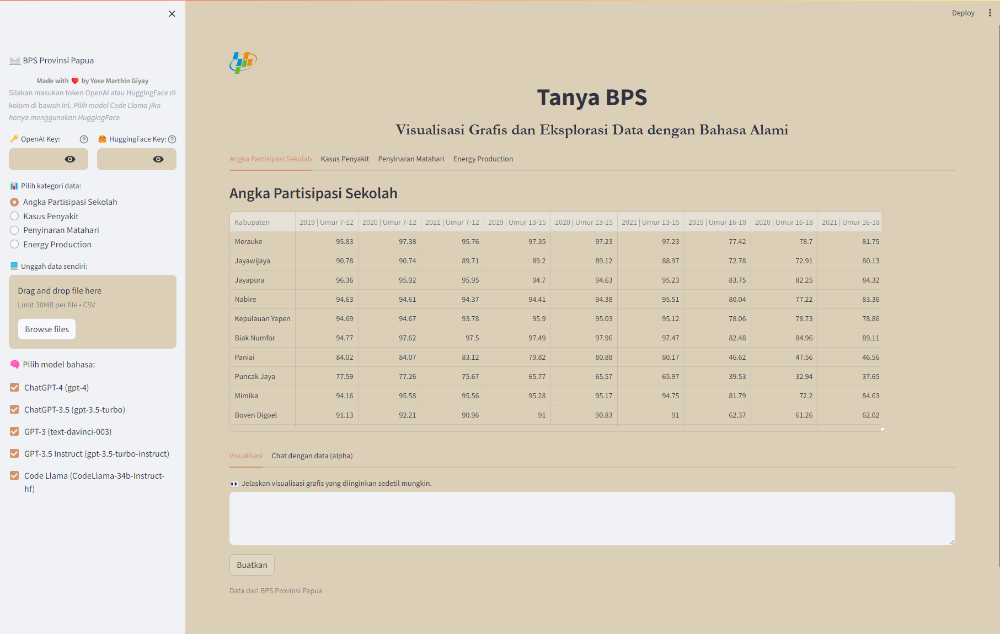

# Asisten Tanya BPS
Streamlit web app untuk ber-*interface* dengan model bahasa besar tentang data dari Badan Pusat Statistik Provinsi Papua. 

* Visualisasi Data: gunakan model bahasa besar untuk menghasilkan berbagai jenis chart (LLM output kode Python untuk langsung ditampilkan)
* (*Dalam pengembangan*) Chat: tanya jawab dengan data BPS Provinsi Papua, temukan tren dan pola besar dalam data, tanya hal spesifik tentang data, layaknya asisten.

# Penggunaan
* Clone repo `git clone https://github.com/yohn-maistre/bps-data-vis-chat`
* Install reqs `pip install -r requirements.txt`
* Run app locally `streamlit run main.py`

